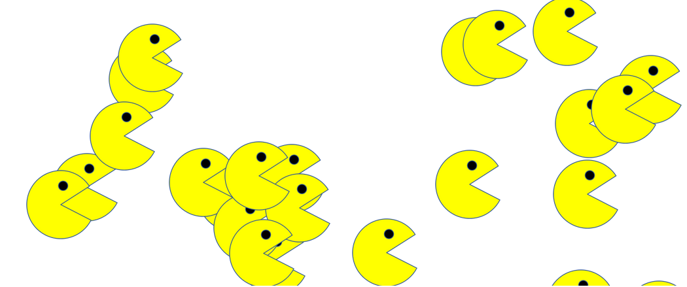

# Jumping Pacmen

<h2>Description of the project</h2>

This project was completed as part of the  MIT Fullstack Development Bootcamp course. This is a gaming project that creates unlimited jumping pacmen.
 

<h2>How to Run:</h2>

You can clone the repository and run the index.html in the browser. or click below link to run in github.

<a href="https://raman-prakash.github.io/jumping-pacmen/">Click here play the game!<a/>

<h2>Roadmap of future improvements:</h2>
<ol>
  <li>Add different jumping style</li>  
 </ol>

<h2>License information:</h2>

Standard GitHub MIT license.

